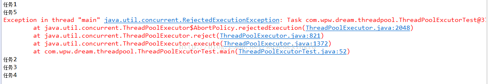
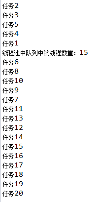

# Java 线程池总结
## 1. 为什么要使用线程池
有时候，系统需要处理非常多的执行时间很短的请求，如果每一个请求都开启一个新线程的话，系统就要不断的进行线程的创建和销毁，有时花在创建和销毁线程上的时间会比线程真正执行的时间还长。而且当线程数量太多时，系统不一定能受得了。

> 1. **通过重用线程池中的线程，来减少每个线程创建和销毁的性能开销**。
> 2. **对线程进行一些维护和管理，比如定时开始，周期执行，并发数控制等等**。

## 2. 线程池的创建
Java提供了4钟线程池：
> newCachedThreadPool  
> newFixedThreadPool  
> newSingleThreadExecutor  
> newScheduledThreadPool

你可以通过Executors来实例化这四种线程池。  
查看源码会发现，这四种线程池都直接或者间接获取的ThreadPoolExecutor实例 ，只是实例化时传递的参数不一样。所以如果java提供的四种线程池满足不了我们的需求，我们可以创建自定义线程池。

ThreadPoolExecutor的构造方法如下：

```
public ThreadPoolExecutor(int corePoolSize,
                          int maximumPoolSize,
                          long keepAliveTime,
                          TimeUnit unit,
                          BlockingQueue<Runnable> workQueue,
                          ThreadFactory threadFactory,
                          RejectedExecutionHandler handler) 
```
其中：

**corePoolSize**： 核心池的大小。 当有任务来之后，就会创建一个线程去执行任务，当线程池中的线程数目达到corePoolSize后，就会把到达的任务放到缓存队列当中

**maximumPoolSize**： 线程池最大线程数，它表示在线程池中最多能创建多少个线程；

**keepAliveTime**： 表示线程没有任务执行时最多保持多久时间会终止。

**unit**： 参数keepAliveTime的时间单位，有7种取值，在TimeUnit类中有7种静态属性：

> 
TimeUnit.DAYS;               //天  
TimeUnit.HOURS;             //小时  
TimeUnit.MINUTES;           //分钟  
TimeUnit.SECONDS;           //秒  
TimeUnit.MILLISECONDS;      //毫秒  
TimeUnit.MICROSECONDS;      //微妙  
TimeUnit.NANOSECONDS;       //纳秒  

**workQueue**： 一个阻塞队列，用来存储等待执行的任务。 一般来说，这里的阻塞队列有以下几种选择：

>
ArrayBlockingQueue  
LinkedBlockingQueue    
SynchronousQueue

**threadFactory**： 线程工厂，主要用来创建线程；
**handler**： 表示当拒绝处理任务时的策略，有以下四种取值：
> 
**ThreadPoolExecutor.AbortPolicy**:丢弃任务并抛出RejectedExecutionException异常。
**ThreadPoolExecutor.DiscardPolicy**：也是丢弃任务，但是不抛出异常。  
**ThreadPoolExecutor.DiscardOldestPolicy**：丢弃队列最前面的任务，然后重新尝试执行任务（重复此过程）。  
**ThreadPoolExecutor.CallerRunsPolicy**：只要线程池不关闭，该策略直接在调用者线程中，运行当前被丢弃的任务。

个人认为这4中策略不友好，最好自己定义拒绝策略，实现RejectedExecutionHandler接口。

## 线程池的三种排队策略

### 1.直接提交
直接提交策略表示线程池不对任务进行缓存。新进任务直接提交给线程池，当线程池中没有空闲线程时，创建一个新的线程处理此任务。**这种策略需要线程池具有无限增长的可能性**。  
实现为：**SynchronousQueue**。

### 2.有界队列
1. 初始的poolSize < corePoolSize，提交的runnable任务，会直接做为new一个Thread的参数，立马执行 。
2. 当提交的任务数超过了corePoolSize，会将当前的runable提交到一个block queue中,。
3. 有界队列满了之后，如果poolSize < maximumPoolsize时，会尝试new 一个Thread的进行救急处理，立马执行对应的runnable任务。
4. 如果3中也无法处理了，就会走到第四步执行reject操作。

```
public class ThreadPoolExcutorTest implements Runnable {
	public String name;
	
	public ThreadPoolExcutorTest(String name) {
		this.name = name;
	}
	
	@Override
	public void run() {
		System.out.println(name);
		try {
			Thread.sleep(1000);
		} catch (InterruptedException e) {
			e.printStackTrace();
		}
	}
	
	public static void main(String[] args) {
		BlockingQueue<Runnable> workQueue = new ArrayBlockingQueue<>(3);
		ThreadPoolExecutor threadPool = new ThreadPoolExecutor(
							1, //corePoolSize
							2,	//maximumPoolSize
							1L,
							TimeUnit.SECONDS,
							workQueue
							);
		threadPool.execute(new ThreadPoolExcutorTest("任务1"));
		threadPool.execute(new ThreadPoolExcutorTest("任务2"));
		threadPool.execute(new ThreadPoolExcutorTest("任务3"));
		threadPool.execute(new ThreadPoolExcutorTest("任务4"));
		threadPool.execute(new ThreadPoolExcutorTest("任务5"));
		threadPool.execute(new ThreadPoolExcutorTest("任务6"));
		threadPool.shutdown();	
	}
}

```
执行结果：

且线程是两个两个执行的。  
分析：线程池的corePoolSize为1，任务1提交后，线程开始执行，corePoolSize 数量用完，接着任务2、3、4提交，放到了有界队列中，此时有界队列也满了。继续提交任务5，由于当前运行的线程数**poolSize < maximumPoolsize**,线程池尝试new一个新的线程来执行任务5，所以任务5会接着执行。当继续提交任务6,时，poolSize达到了maximumPoolSize，有界队列也满了，所以线程池执行了拒绝操作。  
实现为：**ArrayBlockingQueue**。
### 3.无界队列
与有界队列相比，除非系统资源耗尽，否则无界的任务队列不存在任务入队失败的情况。当有新的任务到来，系统的线程数小于corePoolSize时，则新建线程执行任务。**当达到corePoolSize后，就不会继续增加**，若后续仍有新的任务加入，而没有空闲的线程资源，则任务直接进入队列等待。若任务创建和处理的速度差异很大，无界队列会保持快速增长，直到耗尽系统内存。

```
public class ThreadPoolExcutorTest2 implements Runnable {
 
	public Integer count;
	
	public ThreadPoolExcutorTest2(Integer count) {
		this.count = count;
	}
	
	@Override
	public void run() {
		System.out.println("任务" + count);
		try {
			Thread.sleep(2000);
		} catch (InterruptedException e) {
			e.printStackTrace();
		}
	}
	
	public static void main(String[] args) throws InterruptedException {
		BlockingQueue<Runnable> workQueue = new LinkedBlockingQueue<>();
		
		ThreadPoolExecutor pool = new ThreadPoolExecutor(5, 10, 1L, TimeUnit.SECONDS, workQueue);
		for (int i = 1; i <= 20; i++) {
			pool.execute(new ThreadPoolExcutorTest2(i));
		}
		Thread.sleep(1000);
		System.out.println("线程池中队列中的线程数量：" + workQueue.size());
		pool.shutdown();
	}
}

```
执行结果为：  


如果修改了线程池的maximumPoolSize参数（大于corePoolSize的大小），程序执行结果不受影响。所以对于无界队列，maximumPoolSize的设置设置的再大对于线程的执行是没有影响的。

实现为：**LinkedBlockingQueue**
**Ps：这里说LinkedBlockingQueue是无界队列是不恰当的，只不过如果用无参构造函数初始化，默认的容量是Integer.MAX_VALUE**

## 线程池大小的设置规则
要想合理的配置线程池的大小，首先得分析任务的特性，可以从以下几个角度分析：  
>
1. 任务的性质：CPU密集型任务、IO密集型任务、混合型任务。
2. 任务的优先级：高、中、低。
3. 任务的执行时间：长、中、短。
4. 任务的依赖性：是否依赖其他系统资源，如数据库连接等。

性质不同的任务可以交给不同规模的线程池执行。  

对于不同性质的任务来说
> **CPU密集型任务**应配置尽可能小的线程，如配置CPU个数+1的线程数，

> **IO密集型任务**应配置尽可能多的线程，因为IO操作不占用CPU，不要让CPU闲下来，应加大线程数量，如配置两倍CPU个数+1，  

> **混合型的任务**，如果可以拆分，拆分成IO密集型和CPU密集型分别处理，前提是两者运行的时间是差不多的，如果处理时间相差很大，则没必要拆分了。

若任务对其他系统资源有依赖，如某个任务依赖数据库的连接返回的结果，这时候等待的时间越长，则CPU空闲的时间越长，那么线程数量应设置得越大，才能更好的利用CPU。  
当然具体合理线程池值大小，需要结合系统实际情况，在大量的尝试下比较才能得出，以上只是前人总结的规律。  

**最佳线程数目 = （线程等待时间与线程CPU时间之比 + 1）× CPU数目**

线程等待时间所占比例越高，需要越多线程。线程CPU时间所占比例越高，需要越少线程。

>
1. 高并发、任务执行时间短的业务，线程池线程数可以设置为CPU核数+1，减少线程上下文的切换
2. 并发不高、任务执行时间长的业务要区分开看：
   - 假如是业务时间长集中在IO操作上，也就是IO密集型的任务，因为IO操作并不占用CPU，所以不要让所有的CPU闲下来，可以适当加大线程池中的线程数目，让CPU处理更多的业务
　　- 假如是业务时间长集中在计算操作上，也就是计算密集型任务，这个就没办法了，和（1）一样吧，线程池中的线程数设置得少一些，减少线程上下文的切换
3. 并发高、业务执行时间长，解决这种类型任务的关键不在于线程池而在于整体架构的设计，看看这些业务里面某些数据是否能做缓存是第一步，增加服务器是第二步，至于线程池的设置，设置参考2。最后，业务执行时间长的问题，也可能需要分析一下，看看能不能使用中间件对任务进行拆分和解耦。


## 参考文章
1. [关于线程池，你看这一篇就够了](https://blog.csdn.net/qq_29606255/article/details/84930815)
2. [有界、无界队列对ThreadPoolExcutor执行的影响](https://blog.csdn.net/kusedexingfu/article/details/72491864)